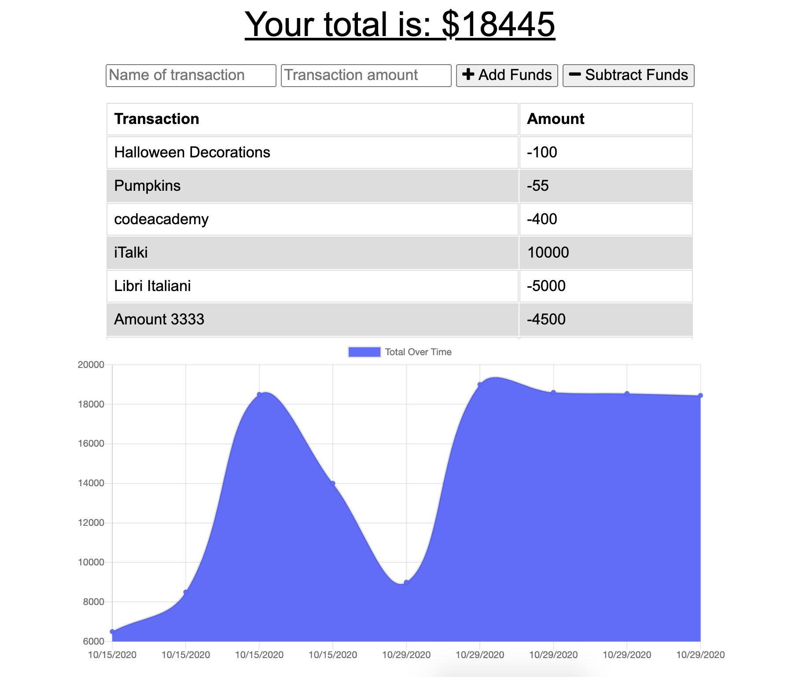

# On-/Off-line Budget Tracker
[](https://opensource.org/licenses/MIT)

## Table of Contents
* [Description](#description)
* [Installation](#installation)
* [Technologies Used](#technologies-used)
* [Application Demo](#application-demo)
* [Contact Information](#contact-information)

## Description
This application will allow users to access and utilize a budget tracker on- or off-line using IndexedDB within the browser.

Users will be able to add expenses and desposits to their budget with or without an internet connection. These transactions will store within the IndexedDB and--when brough back online--will populate the new total and save to the MongoDB database. Perfect for travellers and busy workers alike!

## Installation
This application is deployed on [Heroku](#) for any curious users to satiate their hunger.

Alternatively, users may clone this repository and use the following commands to make begin the application, entering them in an integrated terminal within the main directory:

* ```npm install express```
* ```npm install express-handlebars```
* ```npm install mysql```

After installing these packages to make sure the application functions, users should enter:

* ```node server.js```

This final command will make the app listen on the LocalHost PORT.

If following these commands, users should open their own browsers and go the following address to see the deployed application:

> localhost:8080

## Technologies Used
Node JS, MySQL, Express.js, Handlebars, JavaScript, CSS

## Application Demo
After following the information in the [Installation](#installation) section above--database start within MySQL, navigating to the localhost, as well as running ```node server.js```---users will be greated with an opening page that looks like this:




From here, users may add more burgers in the text box at the bottom of the page OR, if they're feeling the need to satiate their hunger, they may wish use to the **Devour Me!** button to eat a burger of their choosing, which will move the burger to the right-hand side of the screen, showing that it has been consumed:


In addition to being deployed on Heroku, here is a GIF showing the app's full functionality:


## Contact Information
* Jarrod Bataille
  * Portfolio Webpage: https://jtbataille.github.io/
  * GitHub Profile: https://github.com/jtbataille
  * E-mail Address: jtbataille@gmail.com