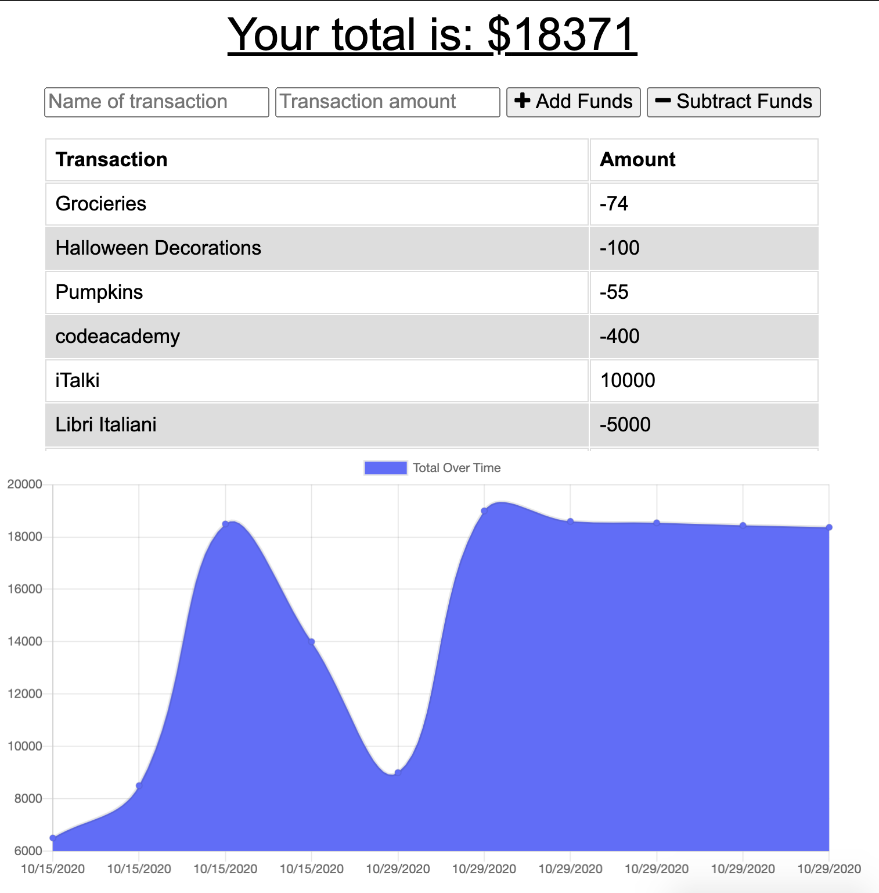

# On-/Off-line Budget Tracker
[](https://opensource.org/licenses/MIT)

## Table of Contents
* [Description](#description)
* [Installation](#installation)
* [Technologies Used](#technologies-used)
* [Application Demo](#application-demo)
* [Contact Information](#contact-information)

## Description
This application will allow users to access and utilize a budget tracker on- or off-line using IndexedDB within the browser.

Users will be able to add expenses and desposits to their budget with or without an internet connection. These transactions will store within the IndexedDB and--when brough back online--will populate the new total and save to the MongoDB database. Perfect for travellers and busy workers alike!

## Installation
This application is deployed on [Heroku](https://sleepy-springs-57650.herokuapp.com/) for any curious users to satiate their hunger.

Alternatively, users may clone this repository and use the following commands to make begin the application, entering them in an integrated terminal within the main directory:

* ```npm install```
OR
* ```npm i```

After installing these packages to make sure the application functions, users should enter:

* ```node server.js```

This final command will cause the app to listen on the LocalHost PORT.

If following these commands, users should open their own browsers and go to the following address to see the deployed application:

> localhost:3000

## Technologies Used
IndexedDB, MongoDB, Mongoose, Lite-Server, Morgan, Compression, Express.js, Handlebars, JavaScript, HTML, CSS

## Application Demo
After following the information in the [Installation](#installation) section above--database start within MySQL, navigating to the localhost, as well as running ```node server.js```---users will be greated with an opening page that looks like this:


Being on or offline, users should enter a transaction's name and value to the input fields and then select to either *"Add Funds"* to their current balance or *"Subtract Funds"* from their current balance, resulting in the transaction being moved to the list above the graph:



In addition to being deployed on Heroku, here is a GIF showing the app's full functionality:


## Contact Information
* Jarrod Bataille
  * Portfolio Webpage: https://jtbataille.github.io/
  * GitHub Profile: https://github.com/jtbataille
  * E-mail Address: jtbataille@gmail.com